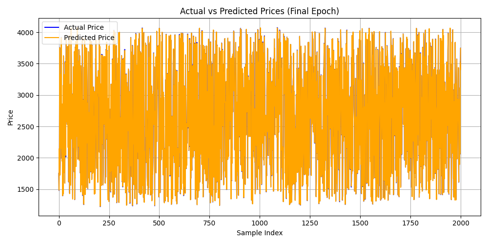
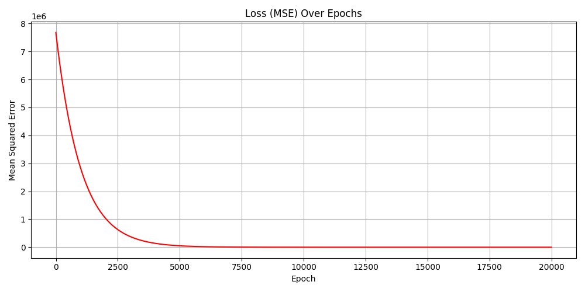
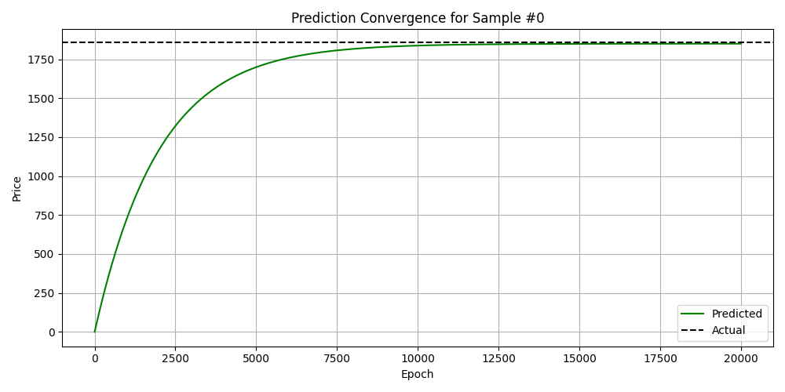
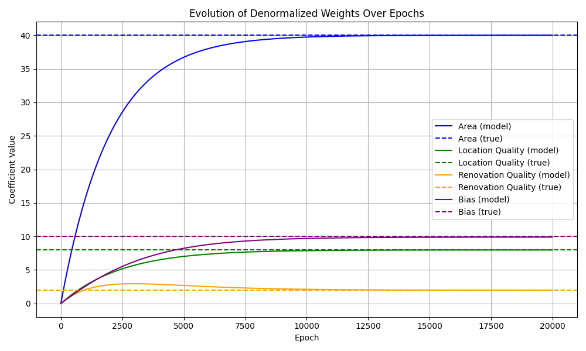

# 🏠 Apartment Price Predictor

This project demonstrates a simple **Linear Regression model** implemented **from scratch** in Python, used to **predict apartment prices** based on three features:

- 🧱 `Area (m²)`
- 📍 `Location Quality (1–10)`
- 🛠 `Renovation Quality (1–5)`

The dataset is **synthetically generated** using a known mathematical formula, allowing precise validation of the model's learning process.

---

## 🚀 Features

- ✅ Manual implementation of gradient descent
- ✅ Feature normalization using **Z-score standardization**
- ✅ Tracking **loss** and **prediction evolution** across epochs
- ✅ Visual comparison of **predicted vs actual prices**
- ✅ Visualization of **weight evolution** (with denormalized values)
- ✅ Fully modular code structure (easy to read and modify)

---

## 📊 Target Formula

The ground truth price is generated as:

```
Price = 40 * Area + 8 * Location_Quality + 2 * Renovation_Quality + 10 + noise
```

---

## 📁 Project Structure

```
project/
│
├── synthetic_data.py        # Dataset generator (synthetic)
├── model.py                 # Custom linear regression with normalization
├── visualizer.py            # All matplotlib plots
├── main.py                  # Main script to train and test
```

---

## 📈 Example Output

```
True Formula:
Price = 40 * Area + 8 * Location_Quality + 2 * Renovation_Quality + 10

Learned Formula (denormalized):
Price = 39.98 * Area + 8.01 * Location_Quality + 2.03 * Renovation_Quality + 9.92

Manual Prediction:
Predicted: 2890.1
Actual:    2890.0
```

---

## 📊 Diagrams (In Order of Execution)

1. **Predicted vs Actual Prices**  
   _Final epoch prediction comparison on test set_  
   

2. **Loss Curve over Epochs**  
   _How training error decreases over time_  
   

3. **Prediction Convergence (Sample)**  
   _How prediction for one object evolves across epochs_  
   

4. **Weight Evolution**  
   _How model weights converge toward the true coefficients_  
   

---

## ✅ Requirements

- Python 3.8+
- `numpy`
- `pandas`
- `matplotlib`
- `scikit-learn`

